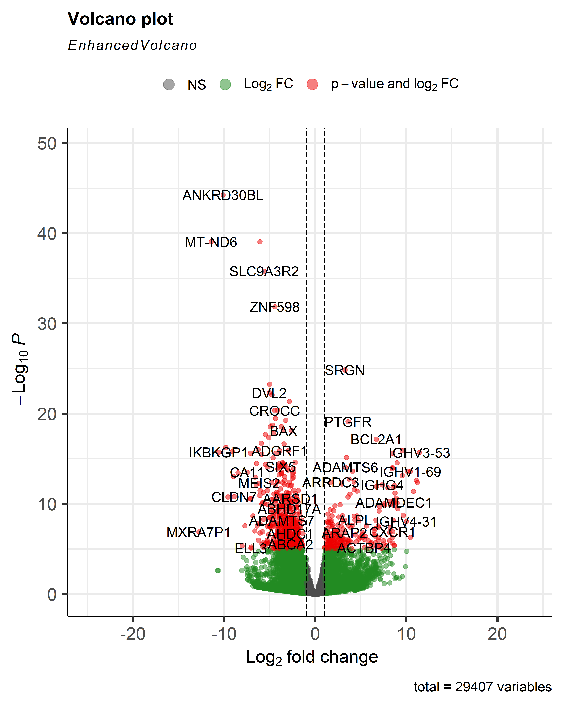

  

# Reumatoide artritis: de veranderde genexpressie met betrekking tot antigeen verwerking en presentatie bepaald met transcriptomics in R.

Om zorg voor Reumatoide atritis patienten te verbeteren, worden hier de veranderingen in genexpressie geanalyseerd, specifiek met betrekking tot antigeen verwerking en presentatie. Hierbij wordt gebruik gemaakt van transcriptomics met behulp van Rstudio.

## Inhoud/structuur

- 'Data/Ruwe data/' - Ruwe data die is verkregen
- 'Data/BAM files/' - Verwerkte data in R waarin staat; welke reads gemapt zijn, waar op het genoom ze gemapt zijn, de mappingkwaliteit en eventuele mismatches
- 'Scripts/' - Scripts in Rstudio die gebruikt zijn om de resultaten te verkrijgen
- 'Resultaten/' - Grafieken en bestanden met resultaten
- 'Bronnen/' - Literatuur gebruikt voor dit onderzoek
- 'Assets/' - Overig gebruikte bestanden en afbeeldingen voor deze pagina

---

## Introductie

Reumatoide artritis (RA) is een chronische gewrichtsziekte, wat kraakbeen en bot schade kan veroorzaken. Deze ernstige symptomen worden vaak geassocieerd met de aanwezigheid van autoantilichamen, wat lijdt tot de zwelling en ontstekingen in gewrichten. Autoantilichamen wijzen op een auto-immuniteit als oorzaak, maar dit is niet de enige oorzaak. De eerste stap richting het ontwikkelen van RA, ligt namelijk genetisch. Daarnaast kan omgeving invloed hebben op het ontwikkelen van RA, door bijvoorbeeld herhalende blootstelling aan virussen, bacterien of schadelijke stoffen. Om ernstige schade aan gewrichten en botten te voorkomen, is het van belang om tijdig gediagnostiseerd te worden [(bron)](Bronnen/Reuma.pdf). Momenteel wordt de diagnose gemaakt aan de hand van symptomen, maar op dat moment is er al significante ontsteking in gewrichten. De ziekte wordt vervolgens symptomatisch behandeld, want een remedie is er niet [(bron)](Bronnen/Diagnose-en-management.pdf). Met meer kennis over de werking van RA, zou er uiteindelijk een tijdige diagnose en behandeling ontwikkeld kunnen worden. Daarom wordt hier bepaald welke genen meer of minder tot expressie komen in personen met RA met betrekking tot antigeen verwerking en presentatie, met behulp van transcriptomics. Dit is de studie van de complete set RNA transcripten dat wordt geproduceerd door het genoom onder specifieke omstandigheden [(bron)](Bronnen/Transcriptomics.pdf).

## Methode

Om te bepalen welke genen veranderd tot expressie komen in patiënten met RA, moesten er analyses uitgevoerd worden op de genexpressie in Rstudio. Hiervoor moest het humane genoom (GRCh38.114) gedownload worden en geïndexeerd (package: Rsubread – 2.20.0). Daarna werden de reads gemapt met dit genoom, hierbij werden BAM-bestanden gemaakt voor elk monster [(Data)](Data/). Hierin wordt weergegeven welke reads gemapt zijn, waar op het genoom ze gemapt zijn en wordt de kwaliteit en mismatches weergegeven (package: Rsamtools – 2.22.0). Om vervolgens de countmatrix uit te voeren, werd een GTF bestand gedownload van het humane genoom. Hiermee werd de countmatrix uitgevoerd, waarbij er bepaald wordt hoeveel reads er op elk gen valt. (Packages: readr – 2.1.5 , dplyr – 1.1.4). Hier werd de matrix met tellingen uitgehaald, waarmee een behandelingstabel werd gemaakt. Met deze tabel en de countmatrix werd een DESeqDataSet gemaakt (package: DESeq2 – 1.46.0), dit werd gesorteerd op opvallende genen, wat gevisualiseerd werd met een Volcano Plot (package: EnhancedVolcano – 1.24.0). Vervolgens werd er een GO-analyse uitgevoerd om betrokken biologische processen te bepalen, waarbij de top 15 is gevisualiseerd (packages: goseq – 1.58.0, geneLenDataBase – 1.42.0, org.Dm.eg.db – 3.20.0, GO.db – 3.20.0, ggplot2 – 3.5.2, tidyverse – 2.0.0). Daarna is er een KEGG analyse gebruikt om genexpressie betrokken bij antigeen verwerking en presentatie te analyseren (package: KEGGREST – 1.46.0).

## Resultaten

Aan de hand van de count matrix is er een volcano plot gemaakt, hier zijn er een groot aantal genen die verhoogde expressie vertonen, zoals weergegeven in figuur 1.

  
  
Figuur 1: Volcano plot waarbij de log2FoldChange aangeeft hoe vaak de expressie is verdubbeld of gehalveerd en de -log10P aangeeft hoe zeker de log2FoldChange is.

  

In de volcano plot is weerggegeven in hoeverre genen veranderde genexpressie hebben, waarbij de Log2FoldChange aangeeft hoe vaak de expressie is verdubbeld of gehalveerd en de -Log10P aangeeft hoe zeker de Log2FoldChange is.

Met de GO-analyse is bepaald welk biologische pad geanalyseerd kan worden met de KEGG-analyse, zoals weergegeven in figuur 2.

  
  
Figuur 2: Go analyse waarbij 15 biologische paden zijn weergegeven.
  
Aan de hand van deze Go-analyse, is een KEGG analyse uitgevoerd op de antigeen verwerking en presentatie, is de verandering in expressie binnen deze route bepaald, zoals weergegeven in figuur 1.

  
  
Figuur 3: KEGG analyse waarbij rode vlakken vergrootte expressie is van een stof en groene vlakken verminderde expressie is.

  

Uit de legenda is waar te nemen dat rode vakken geassocieerd worden met vermeerdering van expressie van die stof en groene vakken met vermindering van expressie. Zo hebben CD8, Natural Killer (NK) cellen en het MHCII pad vergrootte expressie. 

## Conclusie

Na de KEGG analyse, bleken CD8 en NK cellen een hogere expressie te hebben bij patiënten met RA (figuur 1). Dit leidt terug tot genen zoals MHCI (verlaagde expressie) in het endoplasmatisch reticulum en IFNy (verhoogde expressie) bij het immunoproteosoom. Al deze genen zijn betrokken bij het produceren, transporteren of onderhouden van immununcellen. Zo is MHCI coderend voor eiwitten die het mogelijk maken om lichaamseigen van lichaamsvreemd te onderscheiden [(bron)](Bronnen/MHCI.pdf), en speelt TNFa een belangrijke rol in het activeren van een immuunrespons. Omdat alle eerder genoemde genen een belangrijke rol spelen in het immuunsysteem, kan over-/onderexpressie van deze genen leiden tot overmatige ontstekingen en auto-immuunziekten, wat overeenkomt met het ziektebeeld van Reumatoïde Artritis. Daarnaast werd ook overmatige MHCII expressie waargenomen, wat betrokken is bij binding van antigenen en CD4 T-cellen, dit wordt ook vaak geassocieerd met auto-immuunziekten.

Patiënten met Reumatoïde Artritis lijken dus onderexpressie te hebben van MHCI en overexpressie van MHCII en IFNy, wat leidt tot de overmatige ontstekingen en auto-immuunresponses.
